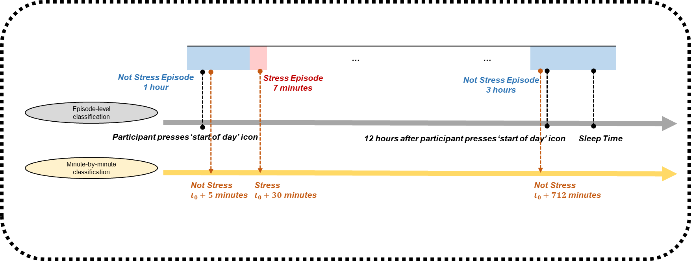

```{r global_options, include=FALSE}
knitr::opts_chunk$set(fig.pos = 'H')
```

```{r setup, include=FALSE}
knitr::opts_chunk$set(echo = TRUE)
options(width = 120)
```


```{r, echo = FALSE, warning=FALSE, message = FALSE}
library(kableExtra)
library(dplyr)
library(lubridate)
source("paths.R")

load(file = file.path(path_staged_data, "dat_masterlist.RData"))
load(file = file.path(path_staged_data, "skeleton.RData"))
load(file = file.path(path_staged_data, "dat_linked.RData"))
load(file = file.path(path_staged_data, "cleaned_dat_stress_episodes.RData"))
```

# Participants and days excluded from all analyses

In this documentation, we refer to the date when the participant was scheduled to have their second in-person lab visit (i.e., their Quit Day) as 'Day 0' and subsequent days as 'Day 1', 'Day 2', ..., and so on. Day 0 was the first day when participants could be micro-randomized. Day 0 marks a significant transition in the _Sense2Stop_ study: only participants who attended their second in-person lab visit were able to have study coordinators activate the _mCerebrum_ app's micro-randomization capabilities;  _mCerebrum_ is an app installed on the mobile phones loaned to participants and orchestrates data collection between the mobile phone and wearables. The last day when participants could be micro-randomized occurred 10 days after Day 0 (i.e., on 'Day 10'). Thus, each participant would have at most 11 days when they could have been micro-randomized. 'Day 10' was also the day prior to the participants' third lab visit, the date when participants were asked to return the mobile phone and wearables loaned to them.


```{r, echo = FALSE, warning=FALSE, message = FALSE}
n_pilot <- dat_masterlist %>% filter(participant_id < 200) %>% nrow(.)
n_missed_visit <- dat_masterlist %>% filter(participant_id > 200) %>% filter(is.na(actual_visit_date)) %>% nrow(.)
n_withdrew <- dat_masterlist %>% filter(participant_id > 200) %>% filter(!is.na(actual_visit_date)) %>% filter(!is.na(withdraw_date)) %>% nrow(.)

tab_drop_from_all <- data.frame(n_participants = c(n_pilot, n_missed_visit, n_withdrew),
                                n_days_per_participant = c(11,11,6))
tab_drop_from_all[["tot_participant_days"]] <- tab_drop_from_all[["n_participants"]] * tab_drop_from_all[["n_days_per_participant"]]
tab_drop_from_all[["rationale"]] <- c("Pilot Participants", "Did not attend their second lab visit", "Withdrew from the study on Day 6")
```

```{r, echo = FALSE, warning=FALSE, message = FALSE}
kable(tab_drop_from_all, 
      format="latex", 
      booktabs=TRUE, 
      caption = "Participants and days excluded from all analysis",
      col.names = c("No. Participants",
                    "No. Days/Participant",
                    "Total Participant-Days",
                    "Rationale")) %>%
  kable_styling(latex_options = c("HOLD_position", "scale_down"))
```

The remainder of this document exclude the participants and days described above.

# Availability for micro-randomization

_Unavailability due to inclement weather_

Although participants generally attended their second in-person lab visit on their scheduled date, there were few instances when participants contacted study coordinators to delay their second in-person lab visit. In all these cases, participants reported that they could not attend their second in-person lab visit on Day 4 due to hazardous weather conditions, but were able to complete their second in-person lab visit on Day 5. We regarded all decision points on Day 0 as unavailable for these participants. _Rationale:_ Study protocol (Section 9.2, Version \#24, 2018-01-12) dictates that during their first in-person lab visit, participants will plan to taper their smoking on the day just prior to their scheduled second in-person clinic visit; participants are asked in advance to plan to engage only in single puff smoking episodes on that day. Hence, regardless of when participants actually completed their second in-person lab visit, we expect participant's smoking behavior on the day of their scheduled second in-person lab visit to reflect a legitimate attempt to quit smoking. Hence, we do not set the _actual_ date of their second in-person visit as Day 0; rather, we set the date of their _scheduled_ second in-person clinic visit as Day 0. In this way, Day 0 can be interpreted as `Quit Day' for all participants in the study.

_Unavailability due to omission of initiating start-of-day_

Micro-randomizations for a particular day of the study (e.g., on Day 9) did not occur unless the participant initiated 'start-of-day' through pressing a start-of-day icon within the _mCerebrum_ app. In other words, for micro-randomizations to occur daily between Day 0 to Day 11, participants needed to press the start-of-day icon within the _mCerebrum_ app daily after waking. We regarded all decision points on those participant-days when the participant did not press the start-of-day icon within the _mCerebrum_ app as unavailable.

```{r, echo = FALSE, warning=FALSE, message = FALSE}
dat_mrt_days <- left_join(x = dat_mrt_days, y = dat_masterlist[,c("participant_id","delayed_days","withdraw_date","scheduled_visit_date","end_study_date")], by = "participant_id")
```

```{r, echo = FALSE, warning=FALSE, message = FALSE}
dat_mrt_days <- dat_mrt_days %>%
  mutate(n_study_days = as.numeric(difftime(time1 = end_study_date, time2 = scheduled_visit_date, units = "days"))) %>%
  mutate(is_dropped_due_to_withdraw = if_else(n_study_days < mrt_day, 1, 0)) %>%
  mutate(is_dropped_due_to_weather = if_else(is_day_avail == 0 & mrt_day == 0 & delayed_days == 1, 1, 0)) %>%
  mutate(is_dropped_due_to_startofday = if_else(is_dropped_due_to_withdraw==0 & is_dropped_due_to_weather==0 & is.na(day_start_time_hrts_local), 1, 0))
```

```{r, echo = FALSE, warning=FALSE, message = FALSE}
tab_unavail_weather <- dat_mrt_days %>% 
  filter(is_dropped_due_to_weather==1) %>%
  group_by(participant_id) %>%
  summarise(n_days = n(), .groups = "keep") %>%
  group_by(n_days) %>%
  summarise(num_participants = n(), .groups = "keep") %>%
  arrange(desc(n_days))

tab_unavail_weather[["total_participant_days"]] <- tab_unavail_weather[["n_days"]] * tab_unavail_weather[["num_participants"]]

tab_unavail_start_of_day <- dat_mrt_days %>% 
  filter(is_dropped_due_to_startofday==1) %>%
  group_by(participant_id) %>%
  summarise(n_days = n(), .groups = "keep") %>%
  group_by(n_days) %>%
  summarise(num_participants = n(), .groups = "keep") %>%
  arrange(desc(n_days))

tab_unavail_start_of_day[["total_participant_days"]] <- tab_unavail_start_of_day[["n_days"]] * tab_unavail_start_of_day[["num_participants"]]
```

```{r, echo = FALSE, warning=FALSE, message = FALSE}
tab_all <- rbind(tab_unavail_weather, tab_unavail_start_of_day)

kable(tab_all, 
      format="latex", 
      booktabs=TRUE, 
      caption = "Participant-days when no decision points were regarded as available for micro-randomization",
      col.names = c("No. Days/Participant",
                    "No. Participants",
                    "Total Participant-Days")) %>%
  kable_styling(latex_options = c("HOLD_position")) %>% 
  pack_rows("Inclement weather", 1, 2) %>%
  pack_rows("Start-of-day was not initiated", 2, nrow(tab_all))
```

_Unavailability for micro-randomizations determined in real-time by the mCerebrum app_

Only the 720 minutes following initiation of start-of-day can be potentially regarded by the _mCerebrum_ app as available for micro-randomization. We refer to start-of-day as DP 0, and the 1, 2, ..., 720 minutes after start-of-day as DP 1, 2, 720. Hence, the upper limit in the number of available decision points (DP's) for each participant-day is 721.

Availability for micro-randomization is determined in real-time by the mCerebrum app via a decision rule (see Figure 2 in Battalio, et al., 2021) involving consideration of the following conditions as long as a particular DP (among DP 0, DP 1, DP 720) does not fall after 'sleep time'. 

In brief, 'sleep time' refers to the time of day at which the _mCerebrum_ app automatically paused Random EMA and EMI delivery until the next time start-of-day is initiated; 'sleep time' was pre-set by study staff in consultation with the participant prior to completion of the first in-person clinic visit. Hence, DP's which occur after 'sleep time', but prior to the next time start-of-day was initiated will be regarded as unavailable for micro-randomization.

* Whether the participant was at the _peak_ of an episode
* Whether less than 50% of minutes between the _start_ and _peak_ of an episode could be regarded as having poor data quality
* Whether the episode was classified as _stress_ or _not stress_
* Whether privacy mode was not activated
* Whether time since last Random EMA was more than 10 minutes
* Whether time since last participant-initiated EMA was more than 10 minutes
* Whether the participant was not physically active in the last 5 minutes
* Whether the participant was not driving in the last 5 minutes
* Whether the mobile phone's battery was greater than 10% in the last 5 minutes

```{r, echo = FALSE, warning=FALSE, message = FALSE}
dat_linked <- left_join(x = dat_linked, y = dat_mrt_days[, c("participant_id", "mrt_day", "is_dropped_due_to_withdraw", "is_dropped_due_to_weather","is_dropped_due_to_startofday")], by = c("participant_id","mrt_day"))
```

```{r, echo = FALSE, warning=FALSE, message = FALSE}
tab_avail_app <- dat_linked %>%
  filter(is_dropped_due_to_withdraw == 0 & is_dropped_due_to_weather == 0 & is_dropped_due_to_startofday == 0) %>%
  group_by(participant_id, mrt_day) %>%
  summarise(cnt_avail = sum(is_minute_avail==1), .groups = "keep") %>%
  group_by(cnt_avail) %>%
  summarise(num_participant_days = n(), .groups = "keep") %>%
  arrange(desc(cnt_avail))

tab_avail_app[["total_dp"]] <- tab_avail_app[["cnt_avail"]] * tab_avail_app[["num_participant_days"]]
grand_total <- sum(tab_avail_app[["total_dp"]])
tmp <- data.frame(num_participant_days = NA, cnt_avail = NA, total_dp = grand_total)
tab_avail_app <- rbind(tab_avail_app, tmp)
```

```{r, echo = FALSE, warning=FALSE, message = FALSE}
dat_subset_linked <- dat_linked %>%
  filter(mins_elapsed < 721 - 120) %>%
  filter(is_dropped_due_to_withdraw == 0 & is_dropped_due_to_weather == 0 & is_dropped_due_to_startofday == 0) 

tab_avail_app_within_M <- dat_subset_linked %>%
  group_by(participant_id, mrt_day) %>%
  summarise(cnt_avail = sum(is_minute_avail==1), .groups = "keep") %>%
  group_by(cnt_avail) %>%
  summarise(num_participant_days = n(), .groups = "keep") %>%
  arrange(desc(cnt_avail))

tab_avail_app_within_M[["total_dp"]] <- tab_avail_app_within_M[["cnt_avail"]] * tab_avail_app_within_M[["num_participant_days"]]
grand_total <- sum(tab_avail_app_within_M[["total_dp"]])
tmp <- data.frame(num_participant_days = NA, cnt_avail = NA, total_dp = grand_total)
tab_avail_app_within_M <- rbind(tab_avail_app_within_M, tmp)
```

\newpage

```{r, echo = FALSE, warning=FALSE, message = FALSE}
options(knitr.kable.NA = "")

kable(tab_avail_app, 
      format="latex", 
      booktabs=TRUE, 
      caption = "Among participant-days not included in Table 1 or Table 2, count decision points (DP's) regarded by the mCerebrum app as available for micro-randomization.",
      col.names = c("No. DP's/Participant-Day",
                    "No. Participant-Days",
                    "Total DP's")) %>%
  kable_styling(latex_options = c("HOLD_position")) %>%
  pack_rows("Grand Total:", nrow(tab_avail_app), nrow(tab_avail_app) -1)
```

\newpage

```{r, echo = FALSE, warning=FALSE, message = FALSE}
options(knitr.kable.NA = "")

kable(tab_avail_app_within_M, 
      format="latex", 
      booktabs=TRUE, 
      caption = "Among participant-days not included in Table 1 or Table 2, count decision points (DP's) regarded by the mCerebrum app as available for micro-randomization. In contrast with Table 3, the current table does not count the last 720 - M DP's; here, M=120 minutes. In other words, the last 720 - 120 = 600 DP's will not be included in the analytic dataset, i.e., these DP's were excluded.",
      col.names = c("No. DP's/Participant-Day",
                    "No. Participant-Days",
                    "Total DP's")) %>%
  kable_styling(latex_options = c("HOLD_position")) %>%
  pack_rows("Grand Total:", nrow(tab_avail_app_within_M), nrow(tab_avail_app_within_M) -1)
```


\newpage

```{r, echo = FALSE, warning=FALSE, message = FALSE}
rm(list = ls())

library(kableExtra)
library(dplyr)
library(lubridate)
source("paths.R")

load(file = file.path(path_staged_data, "dat_masterlist.RData"))
load(file = file.path(path_staged_data, "skeleton.RData"))
load(file = file.path(path_staged_data, "dat_linked.RData"))
load(file = file.path(path_staged_data, "cleaned_dat_stress_episodes.RData"))
```

# Working with predictions of a stress episode detection algorithm

_Decision rules to link stress/not stress/physically active episodes to specific participant-days_

In this section, given a specific participant-day, let $t_0$ denote the time-of-day when the participant initiates start-of-day and $t_0 + 720$ be 720 minutes following the moment when the participant initiates start-of-day. Stress/not stress/physically active episodes are linked to participant-days in which start-of-day was initiated, i.e., we do not attempt a linkage of episodes to participant-days in which start-of-day was not initiated.

Among participant-days not included in Table 1 or Table 2, a stress/not stress/physically active episode was linked to a specific participant-day if the episode:

* **(Case 1)** Began and ended within time time interval $\left[t_0, t_0 + 720\right]$, i.e., $A, C \in \left[t_0, t_0 + 720\right]$
* **(Case 2)** Began after start-of-day was initiated, i.e., $A \in \left[t_0, t_0 + 720\right]$, but ended after 720 minutes following the moment when the participant initiates start-of-day, i.e., $C \not \in \left[t_0, t_0 + 720\right]$
* **(Case 3)** Began prior to when start-of-day was initiated, i.e., $A \not \in \left[t_0, t_0 + 720\right]$, but ended prior to 720 minutes following the moment when the participant initiates start-of-day, i.e., $C \in \left[t_0, t_0 + 720\right]$


```{r, echo = FALSE, warning=FALSE, message = FALSE}
tab_episodes_count <- dat_episodes %>%
  filter(!is.na(episode_classification)) %>%
  group_by(episode_classification) %>%
  summarise(cnt = n(), .groups = "keep") %>%
  mutate(episode_classification = replace(episode_classification, episode_classification=="active", "Physically Active")) %>%
  mutate(episode_classification = replace(episode_classification, episode_classification=="no", "Not Stress")) %>%
  mutate(episode_classification = replace(episode_classification, episode_classification=="yes", "Stress")) %>%
  arrange(desc(episode_classification))
```


```{r, echo = FALSE, warning=FALSE, message = FALSE}
kable(tab_episodes_count, 
      format="latex", 
      booktabs=TRUE, 
      caption = "No. Episodes Classified as Stressed/Not Stressed/Physically Active",
      col.names = c("Episode Classification","No. Episodes")) %>%
  kable_styling(latex_options = c("HOLD_position"))
```


```{r, echo = FALSE, warning=FALSE, message = FALSE}
subset_dat_episodes <- dat_episodes[duplicated(dat_episodes$episode_id),]
num_dups <- nrow(subset_dat_episodes)
num_not_unique <- length(unique(subset_dat_episodes[["episode_id"]])) - num_dups
smallest <- min(subset_dat_episodes$AC_hours)
largest <- max(subset_dat_episodes$AC_hours)
smallest <- round(smallest, 2)
largest <- round(largest, 2)
```

We note that the above approach of linking episodes to participant-days generally results in each episode being linked to one and only one participant-day. Exceptions are `r num_dups` episodes which are each linked to `r ifelse(num_not_unique==0, 2, -999)` participant-days. These episodes belong to either Case 2 or Case 3 above and range between `r smallest` and `r largest` hours long, i.e., hours elapsed between A and C range between `r smallest` and `r largest` hours.

_Linking episode-level stress/not stress/physically active classifications to minute-by-minute classifications_

Each minute between $t_0$ and $t_0 + 720$ is labelled as a stress/not stress/physically active minute if it lies within a stress/not stress/physically active episode. Episodes considered are only those which have been linked to the specific participant-day using the rules described above.

```{r, echo=FALSE, out.width="90%", out.height="90%", fig.align="center", fig.cap = "A visual depiction of how episode-level stress/not stress/physically active classifications are linked to minute-by-minute stress/not stress/physically active classifications in one hypothetical participant-day."}

```

_How often and how long were the Stress/Not Stress/Physically Active Episodes?_

```{r, echo = FALSE, warning=FALSE, message = FALSE}
tab_episodes_stress_AB <- dat_episodes %>%
  filter(episode_classification == "yes") %>%
  summarise(q0 = quantile(AB_mins, 0),
            q10 = quantile(AB_mins, .10),
            q50 = quantile(AB_mins, .50),
            q90 = quantile(AB_mins, .90),
            q100 = quantile(AB_mins, 1))

tab_episodes_stress_BC <- dat_episodes %>%
  filter(episode_classification == "yes") %>%
  summarise(q0 = quantile(BC_mins, 0),
            q10 = quantile(BC_mins, .10),
            q50 = quantile(BC_mins, .50),
            q90 = quantile(BC_mins, .90),
            q100 = quantile(BC_mins, 1))

tab_episodes_stress_AC <- dat_episodes %>%
  filter(episode_classification == "yes") %>%
  summarise(q0 = quantile(AC_mins, 0),
            q10 = quantile(AC_mins, .10),
            q50 = quantile(AC_mins, .50),
            q90 = quantile(AC_mins, .90),
            q100 = quantile(AC_mins, 1))

tab_all <- rbind(tab_episodes_stress_AB, tab_episodes_stress_BC, tab_episodes_stress_AC)
tab_all <- round(tab_all, 2)
```

```{r, echo = FALSE, warning=FALSE, message = FALSE}
row.names(tab_all) <- c("Start to Peak (A to B)", "Peak to End (B to C)","Start to End (A to C)")

kable(tab_all, 
      format="latex", 
      booktabs=TRUE, 
      caption = "Minutes elapsed between the start, peak, and end of stress episodes, summarized in percentiles",
      col.names = c("0% (MIN)", "10%", "50% (MEDIAN)", "90%", "100% (MAX)")) %>%
  kable_styling(latex_options = c("HOLD_position"))
```


```{r, echo = FALSE, warning=FALSE, message = FALSE}
tab_episodes_not_stress_AB <- dat_episodes %>%
  filter(episode_classification == "no") %>%
  summarise(q0 = quantile(AB_mins, 0),
            q10 = quantile(AB_mins, .10),
            q50 = quantile(AB_mins, .50),
            q90 = quantile(AB_mins, .90),
            q100 = quantile(AB_mins, 1))

tab_episodes_not_stress_BC <- dat_episodes %>%
  filter(episode_classification == "no") %>%
  summarise(q0 = quantile(BC_mins, 0),
            q10 = quantile(BC_mins, .10),
            q50 = quantile(BC_mins, .50),
            q90 = quantile(BC_mins, .90),
            q100 = quantile(BC_mins, 1))

tab_episodes_not_stress_AC <- dat_episodes %>%
  filter(episode_classification == "no") %>%
  summarise(q0 = quantile(AC_mins, 0),
            q10 = quantile(AC_mins, .10),
            q50 = quantile(AC_mins, .50),
            q90 = quantile(AC_mins, .90),
            q100 = quantile(AC_mins, 1))

tab_all <- rbind(tab_episodes_not_stress_AB, tab_episodes_not_stress_BC, tab_episodes_not_stress_AC)
tab_all <- round(tab_all, 2)
```

```{r, echo = FALSE, warning=FALSE, message = FALSE}
row.names(tab_all) <- c("Start to Peak (A to B)", "Peak to End (B to C)","Start to End (A to C)")

kable(tab_all, 
      format="latex", 
      booktabs=TRUE, 
      caption = "Minutes elapsed between the start, peak, and end of not stress episodes, summarized in percentiles",
      col.names = c("0% (MIN)", "10%", "50% (MEDIAN)", "90%", "100% (MAX)")) %>%
  kable_styling(latex_options = c("HOLD_position"))
```


# Overlapping windows?

We use DP's included in Table 4 as our starting point. In contrast to those DP's in Table 3, we excluded DP's $\left\{720 - m: m = 1, 2, 3, ..., M\right\}$, where $M=120$. In other words, we additionally excluded the DP's for which we will not be able to 'look ahead' for a full $M=120$ minutes. 

```{r, echo = FALSE, warning=FALSE, message = FALSE}
rm(list = ls())

library(kableExtra)
library(dplyr)
library(lubridate)
source("paths.R")

load(file = file.path(path_staged_data, "dat_masterlist.RData"))
load(file = file.path(path_staged_data, "skeleton.RData"))
load(file = file.path(path_staged_data, "dat_linked.RData"))
load(file = file.path(path_staged_data, "cleaned_dat_stress_episodes.RData"))
```

```{r, echo = FALSE, warning=FALSE, message = FALSE}
list_all <- list()
M <- 120
all_participants <- unique(dat_linked[["participant_id"]])
all_days <- unique(dat_linked[["mrt_day"]])

for(current_participant in all_participants){
  for(current_day in all_days){
    current_dat <- dat_linked %>%
      filter(participant_id == current_participant) %>%
      filter(mrt_day == current_day) %>%
      select(participant_id, mrt_day, mins_elapsed, is_minute_avail, isTriggered, 
             isPreLapse, isStress)
    
    list_excursion <- list()
    for(current_row in 1:(nrow(current_dat) - M)){
      excursion <- current_dat[["isTriggered"]][(current_row + 1):(current_row + M)]
      excursion <- matrix(excursion, nrow = 1)
      list_excursion <- append(list_excursion, list(excursion))
    }
    
    dat_excursion <- do.call(rbind, list_excursion)
    num_coinflips <- apply(dat_excursion, 1, function(this_row){
      count_coinflips <- sum(!is.na(this_row))
      return(count_coinflips)
    })
    num_prompts <- apply(dat_excursion, 1, function(this_row){
      count_coinflips <- sum(!is.na(this_row))
      num_prompts <- 0
      if(count_coinflips > 0){
        num_prompts <- sum(this_row==1, na.rm=TRUE)
      }
      return(num_prompts)
    })
    
    current_dat <- current_dat[1:(nrow(current_dat) - M),]
    current_dat[["num_coinflips"]] <- num_coinflips
    current_dat[["num_prompts"]] <- num_prompts
    
    list_all <- append(list_all, list(current_dat))
  }
}

dat_all <- do.call(rbind, list_all)
```

```{r, echo = FALSE, warning=FALSE, message = FALSE}
options(knitr.kable.NA = "")

tab_rand <- dat_all %>%
  filter(is_minute_avail == 1) %>%
  group_by(isTriggered) %>%
  summarise(overall = n(),
            cnt_none_coinflips = sum(num_coinflips == 0),
            cnt_any_coinflips = sum(num_coinflips > 0))

tab_rand <- tab_rand %>%
  mutate(isTriggered = case_when(
    isTriggered == 1 ~ "Micro-randomized to 'Prompt'",
    isTriggered == 0 ~ "Micro-randomized to 'No Prompt'",
    TRUE ~ NA_character_
  ))

new_row <- data.frame(isTriggered = NA_character_, 
                      overall = sum(tab_rand[["overall"]]),
                      cnt_none_coinflips = sum(tab_rand[["cnt_none_coinflips"]]),
                      cnt_any_coinflips = sum(tab_rand[["cnt_any_coinflips"]])
                      )
tab_rand <- rbind(tab_rand, new_row)
```

```{r, echo = FALSE, warning=FALSE, message = FALSE}
kable(tab_rand, 
      format="latex", 
      booktabs=TRUE, 
      caption = "Among DP's regarded as available for micro-randomization in Table 4: How many were followed by any microrandomization within the next M=120 minutes?",
      col.names = c("Randomization assignment", "Total Number of DP's", "Without any micro-randomization", "With any micro-randomization")) %>%
  kable_styling(latex_options = c("HOLD_position", "scale_down")) %>%
  add_header_above(c("At current DP (k)"=2, "Among current DP's (k),\nin how many did any of the following occur\nwithin the next M=120 minutes\n(i.e., (k+1, k+1, ..., k+M))?"=2)) %>%
  pack_rows("Grand Total:", nrow(tab_rand), nrow(tab_rand)-1)
```

Hence, Table 8 shows that among the 4744 DP's regarded as available for micro-randomization in the $k^{th}$ DP, 4402 were followed by a micro-randomization within the next $M=120$ minutes. This is further broken down:

* Among the 4160 DP's micro-randomized to `No Prompt' in the $k^{th}$ DP, 3949 were followed by a micro-randomization within the next $M=120$ minutes.
* Among the 584 DP's micro-randomized to `Prompt' in the $k^{th}$ DP, 453 were followed by a micro-randomization within the next $M=120$ minutes.

Next, we break down the last column of Table 8.

```{r, echo = FALSE, warning=FALSE, message = FALSE}
options(knitr.kable.NA = "")

tab_rand <- dat_all %>%
  filter(is_minute_avail == 1) %>%
  group_by(isTriggered) %>%
  filter(num_coinflips > 0) %>%
  summarise(overall = n(),
            cnt_none_prompts = sum(num_prompts == 0),
            cnt_any_prompts = sum(num_prompts > 0))

tab_rand <- tab_rand %>%
  mutate(isTriggered = case_when(
    isTriggered == 1 ~ "Micro-randomized to 'Prompt'",
    isTriggered == 0 ~ "Micro-randomized to 'No Prompt'",
    TRUE ~ NA_character_
  ))

new_row <- data.frame(isTriggered = NA_character_, 
                      overall = sum(tab_rand[["overall"]]),
                      cnt_none_prompts = sum(tab_rand[["cnt_none_prompts"]]),
                      cnt_any_prompts = sum(tab_rand[["cnt_any_prompts"]])
                      )
tab_rand <- rbind(tab_rand, new_row)
```

```{r, echo = FALSE, warning=FALSE, message = FALSE}
kable(tab_rand, 
      format="latex", 
      booktabs=TRUE, 
      caption = "Among DP's regarded as available in Table 4 and were followed by any micro-randomization within the next M=120 minutes, how many were micro-randomized to `Prompt' within the next M=120 minutes?",
      col.names = c("Randomization assignment", "Total Number of DP's", "Never Micro-randomized to `Prompt'", "Micro-randomized to `Prompt'")) %>%
  kable_styling(latex_options = c("HOLD_position", "scale_down")) %>%
  add_header_above(c("At current DP (k)"=2, "Among current DP's (k),\nin how many did any of the following occur\nwithin the next M=120 minutes\n(i.e., (k+1, k+1, ..., k+M))?"=2)) %>%
  pack_rows("Grand Total:", nrow(tab_rand), nrow(tab_rand)-1)
```

Hence, Table 9 shows that among the 4402 DP's regarded as available for micro-randomization in the $k^{th}$ DP and were followed by a micro-randomization within the next $M=120$ minutes, 1744 were micro-randomized to `Prompt' within the next $M=120$ minutes. This is further broken down:

* Among the 3949 DP's micro-randomized to `No Prompt' in the $k^{th}$ DP, 1616 were followed by a micro-randomization to 'Prompt' within the next $M=120$ minutes.
* Among the 453 DP's micro-randomized to `Prompt' in the $k^{th}$ DP, 128 were followed by a micro-randomization to 'Prompt' within the next $M=120$ minutes.

# References

1. Battalio, S. L., Conroy, D. E., Dempsey, W., Liao, P., Menictas, M., Murphy, S., ... & Spring, B. (2021). Sense2Stop: A micro-randomized trial using wearable sensors to optimize a just-in-time-adaptive stress management intervention for smoking relapse prevention. Contemporary Clinical Trials, 109, 106534.

