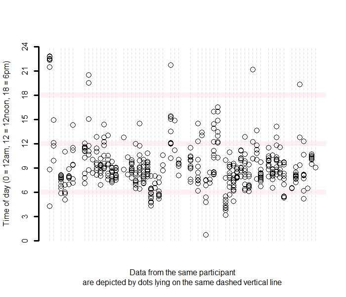

```{r global_options, include=FALSE}
knitr::opts_chunk$set(fig.pos = 'H')
```

```{r setup, include=FALSE}
knitr::opts_chunk$set(echo = TRUE)
options(width = 120)
```

```{r, echo = FALSE, warning=FALSE, message = FALSE}
library(kableExtra)
library(dplyr)
library(lubridate)
source("paths.R")

load(file = file.path(path_staged_data, "dat_masterlist.RData"))
load(file = file.path(path_staged_data, "skeleton.RData"))
load(file = file.path(path_staged_data, "dat_linked.RData"))
load(file = file.path(path_staged_data, "cleaned_dat_stress_episodes.RData"))
```

```{r, echo = FALSE, warning=FALSE, message = FALSE}
tab_episodes_count <- dat_episodes %>%
  filter(!is.na(episode_classification)) %>%
  group_by(episode_classification) %>%
  summarise(cnt = n(), .groups = "keep") %>%
  mutate(episode_classification = replace(episode_classification, episode_classification=="active", "Physically Active")) %>%
  mutate(episode_classification = replace(episode_classification, episode_classification=="no", "Not Stress")) %>%
  mutate(episode_classification = replace(episode_classification, episode_classification=="yes", "Stress")) %>%
  arrange(desc(episode_classification))
```


```{r, echo = FALSE, warning=FALSE, message = FALSE}
kable(tab_episodes_count, 
      format="latex", 
      booktabs=TRUE, 
      caption = "No. Episodes Classified as Stressed/Not Stressed/Physically Active",
      col.names = c("Episode Classification","No. Episodes")) %>%
  kable_styling(latex_options = c("HOLD_position"))
```

\newpage


```{r, echo=FALSE, out.width="90%", out.height="90%", fig.align="center", fig.cap = "Data from Day 0 (beginning of MRT) onward are displayed; Data from participants who were excluded from all analyses are not displayed"}

```

\newpage


_How often and how long were the Stress/Not Stress/Physically Active Episodes?_

Note: These summary statistics exclude 2 episodes for which the duration of time between A and B is between 24 - 96 hours.

```{r, echo = FALSE, warning=FALSE, message = FALSE}

dat_episodes <- dat_episodes %>% filter(AB_hours <= 24)

tab_episodes_stress_AB <- dat_episodes %>%
  filter(episode_classification == "yes") %>%
  summarise(q0 = quantile(AB_mins, 0),
            q10 = quantile(AB_mins, .10),
            q50 = quantile(AB_mins, .50),
            q90 = quantile(AB_mins, .90),
            q100 = quantile(AB_mins, 1))

tab_episodes_stress_BC <- dat_episodes %>%
  filter(episode_classification == "yes") %>%
  summarise(q0 = quantile(BC_mins, 0),
            q10 = quantile(BC_mins, .10),
            q50 = quantile(BC_mins, .50),
            q90 = quantile(BC_mins, .90),
            q100 = quantile(BC_mins, 1))

tab_episodes_stress_AC <- dat_episodes %>%
  filter(episode_classification == "yes") %>%
  summarise(q0 = quantile(AC_mins, 0),
            q10 = quantile(AC_mins, .10),
            q50 = quantile(AC_mins, .50),
            q90 = quantile(AC_mins, .90),
            q100 = quantile(AC_mins, 1))

tab_all <- rbind(tab_episodes_stress_AB, tab_episodes_stress_BC, tab_episodes_stress_AC)
tab_all <- round(tab_all, 2)
```

```{r, echo = FALSE, warning=FALSE, message = FALSE}
row.names(tab_all) <- c("Start to Peak (A to B)", "Peak to End (B to C)","Start to End (A to C)")

kable(tab_all, 
      format="latex", 
      booktabs=TRUE, 
      caption = "Minutes elapsed between the start, peak, and end of stress episodes, summarized in percentiles",
      col.names = c("0% (MIN)", "10%", "50% (MEDIAN)", "90%", "100% (MAX)")) %>%
  kable_styling(latex_options = c("HOLD_position"))
```


```{r, echo = FALSE, warning=FALSE, message = FALSE}
tab_episodes_not_stress_AB <- dat_episodes %>%
  filter(episode_classification == "no") %>%
  summarise(q0 = quantile(AB_mins, 0),
            q10 = quantile(AB_mins, .10),
            q50 = quantile(AB_mins, .50),
            q90 = quantile(AB_mins, .90),
            q100 = quantile(AB_mins, 1))

tab_episodes_not_stress_BC <- dat_episodes %>%
  filter(episode_classification == "no") %>%
  summarise(q0 = quantile(BC_mins, 0),
            q10 = quantile(BC_mins, .10),
            q50 = quantile(BC_mins, .50),
            q90 = quantile(BC_mins, .90),
            q100 = quantile(BC_mins, 1))

tab_episodes_not_stress_AC <- dat_episodes %>%
  filter(episode_classification == "no") %>%
  summarise(q0 = quantile(AC_mins, 0),
            q10 = quantile(AC_mins, .10),
            q50 = quantile(AC_mins, .50),
            q90 = quantile(AC_mins, .90),
            q100 = quantile(AC_mins, 1))

tab_all <- rbind(tab_episodes_not_stress_AB, tab_episodes_not_stress_BC, tab_episodes_not_stress_AC)
tab_all <- round(tab_all, 2)
```

```{r, echo = FALSE, warning=FALSE, message = FALSE}
row.names(tab_all) <- c("Start to Peak (A to B)", "Peak to End (B to C)","Start to End (A to C)")

kable(tab_all, 
      format="latex", 
      booktabs=TRUE, 
      caption = "Minutes elapsed between the start, peak, and end of not stress episodes, summarized in percentiles",
      col.names = c("0% (MIN)", "10%", "50% (MEDIAN)", "90%", "100% (MAX)")) %>%
  kable_styling(latex_options = c("HOLD_position"))
```


